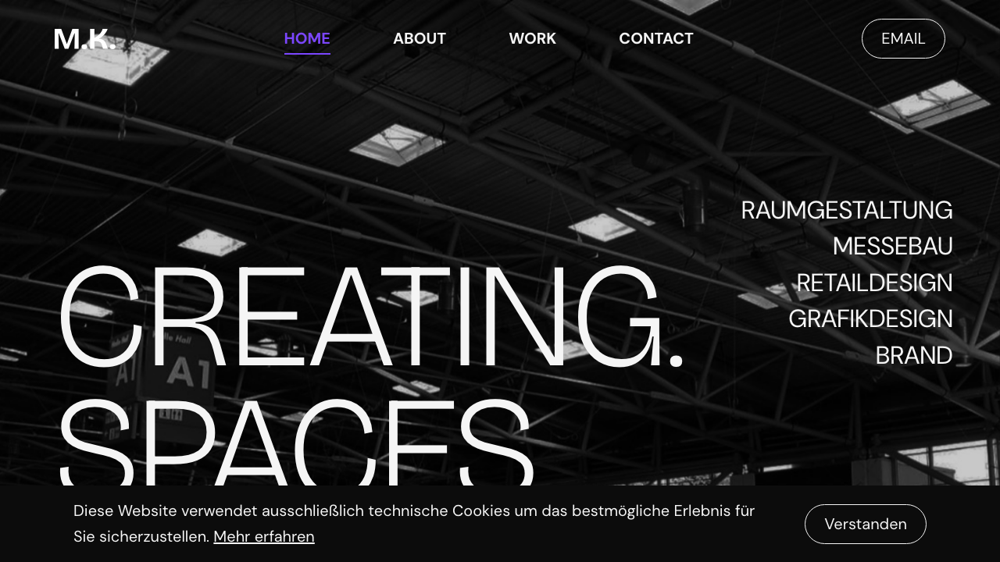

# Marius Knipp Website

Portfolio website for **Marius Knipp** (product and industrial designer), focused on spatial design, trade fair construction, retail design, rendering, and branding.

This project delivers the live portfolio experience and legal pages for [mariusknipp.de](https://mariusknipp.de).



## Overview

- Single-page portfolio experience with section-based navigation
- Dedicated legal pages: `/impressum` and `/datenschutz`
- German-first content and messaging
- Built with React + TypeScript + Tailwind CSS

## Features

- **Hero section** with animated background zoom and decorative star icons
- **Sticky header** with active-section highlighting on scroll
- **About, Services, Projects, Contact** sections with fade-in animations
- **Projects gallery modal**:
  - click-to-open project details
  - image carousel with keyboard support (`Esc`, `←`, `→`)
  - portrait/landscape image handling
- **Parallax-style arrow animation** in Projects section
- **Cookie consent banner** (localStorage-based)
- **Legal pages** with separate legal header and shared footer
- **Responsive design** from mobile to large desktop
- **Accessibility basics**: skip link, focus-visible states, semantic structure

## Tech Stack

- **React 19** + **TypeScript**
- **Create React App** runtime with **CRACO**
- **Tailwind CSS 3** + PostCSS + Autoprefixer
- **React Router** for homepage/legal page routing

## Getting Started

### Prerequisites

- Node.js (LTS recommended)
- npm

### Install

```bash
npm install
```

### Run locally

```bash
npm start
```

App runs at:
- `http://localhost:3000`

### Production build

```bash
npm run build
```

### Test

```bash
npm test
```

## Available Scripts

| Command | Description |
|---|---|
| `npm start` | Start dev server via CRACO |
| `npm run build` | Create production build in `build/` |
| `npm test` | Run test runner |
| `npm run eject` | Eject CRA config (irreversible) |

## Project Structure

```text
src/
  assets/                 # Fonts, icons, project images
  components/
    layout/               # Header, Footer, LegalHeader
    sections/             # Hero, About, Services, Projects, Contact
    ui/                   # Reusable UI (Button, cards, modal, cookie banner)
  data/                   # services.tsx, projects.ts
  hooks/                  # useFadeIn
  pages/                  # Impressum, Datenschutz
  styles/                 # global Tailwind/base styles
```

## Content Maintenance

Update portfolio content here:

- `src/data/services.tsx` — service cards and text
- `src/data/projects.ts` — project cards, metadata, and modal galleries

When adding new project images, place assets in:

- `src/assets/images/projects/<project-name>/...`

Then import and register them in `src/data/projects.ts`.

## Notes

- Main content language is German.
- Fonts are self-hosted variable fonts in `src/assets/fonts/`.
